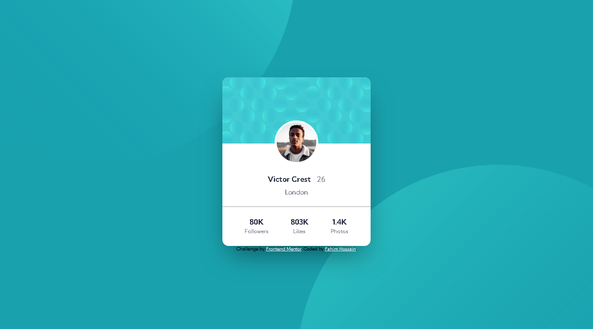

# Frontend Mentor - Profile card component solution

This is a solution to the [Profile card component challenge on Frontend Mentor](https://www.frontendmentor.io/challenges/profile-card-component-cfArpWshJ). Frontend Mentor challenges help you improve your coding skills by building realistic projects.

## Table of contents

- [Overview](#overview)
  - [The challenge](#the-challenge)
  - [Screenshot](#screenshot)
  - [Links](#links)
- [My process](#my-process)
  - [Built with](#built-with)
- [Author](#author)

## Overview

### The challenge

- Build out the project to the designs provided

### Screenshot

### Desktop Preview

### Mobile Preview

### Links

- Solution URL: [Github](https://github.com/Mr-NotSoCreative/profile-card-component-main)
- Live Site URL: [live site](https://your-live-site-url.com)

## My process

### Built with

- Semantic HTML5 markup
- CSS custom properties
- CSS Grid
- CSS Flex

## Author

- Frontend Mentor - [@Mr-NotSoCreative](https://www.frontendmentor.io/profile/Mr-NotSoCreative)
- Github - [@Mr-NotSoCreative](https://github.com/Mr-NotSoCreative)
